# 🍽 Restaurant Rating Prediction using Machine Learning

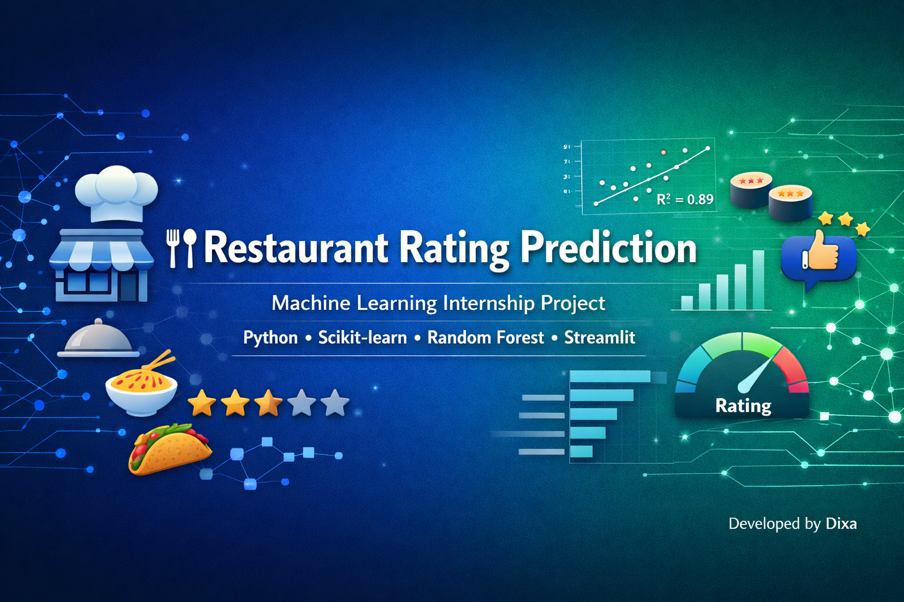


---

# 📌 Project Overview

This project was developed as part of the **Machine Learning Internship at Cognifyz Technologies**.

The objective of this project is to build a Machine Learning model capable of predicting the **Aggregate Rating** of a restaurant using various restaurant characteristics such as cuisine, city, average cost, customer votes, table booking availability, online delivery services, and price range.

The project follows a complete Machine Learning workflow including data preprocessing, exploratory data analysis, feature engineering, model training, model evaluation, and feature importance analysis.

---

# 🎯 Objective

The objectives of this project are:

- Predict restaurant aggregate ratings using Machine Learning.
- Perform data preprocessing and feature engineering.
- Compare multiple regression algorithms.
- Evaluate model performance using regression metrics.
- Analyze the factors influencing restaurant ratings.
- Save the trained model for future prediction.

---

# 📂 Dataset

The dataset contains information about **9,551 restaurants** with **21 features**.

### Dataset Summary

| Attribute | Value |
|-----------|--------|
| Records | 9551 |
| Features | 21 |
| Target Variable | Aggregate Rating |

### Important Features

- Restaurant Name
- City
- Cuisine
- Average Cost for Two
- Currency
- Has Table Booking
- Has Online Delivery
- Price Range
- Votes
- Aggregate Rating

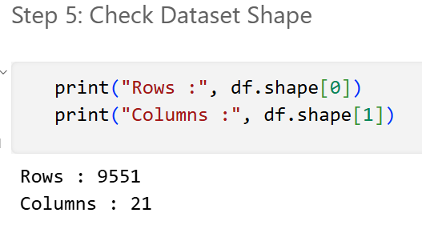

---

# 🧹 Data Cleaning & Preprocessing

The dataset was cleaned before training the Machine Learning models.

### Preprocessing Steps

- Filled missing values in the **Cuisines** column.
- Checked and removed duplicate records.
- Removed unnecessary columns.
- Encoded categorical variables using LabelEncoder.
- Selected relevant features.
- Split the dataset into training and testing datasets.

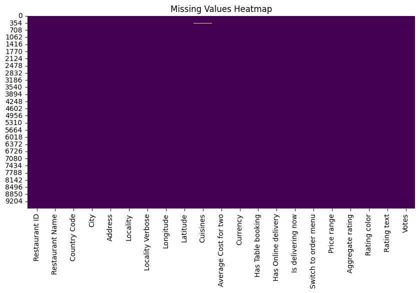

---

# 📊 Exploratory Data Analysis (EDA)

Several visualizations were created to understand the dataset and identify patterns.

## ⭐ Rating Distribution

Understanding how restaurant ratings are distributed

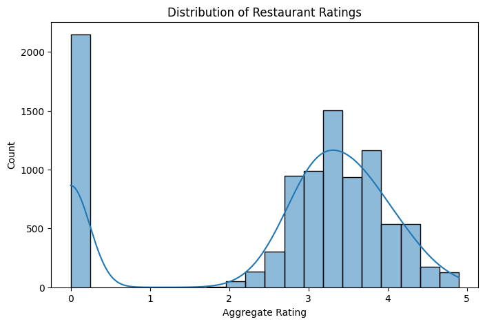

---

## 🌍 Top Cities

Cities having the highest number of restaurants.

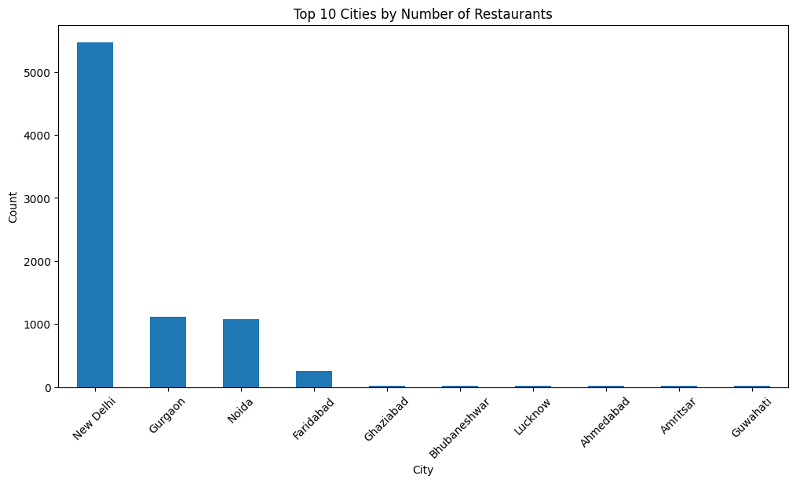

---

## 🍜 Popular Cuisines

Most common cuisines available in the dataset.

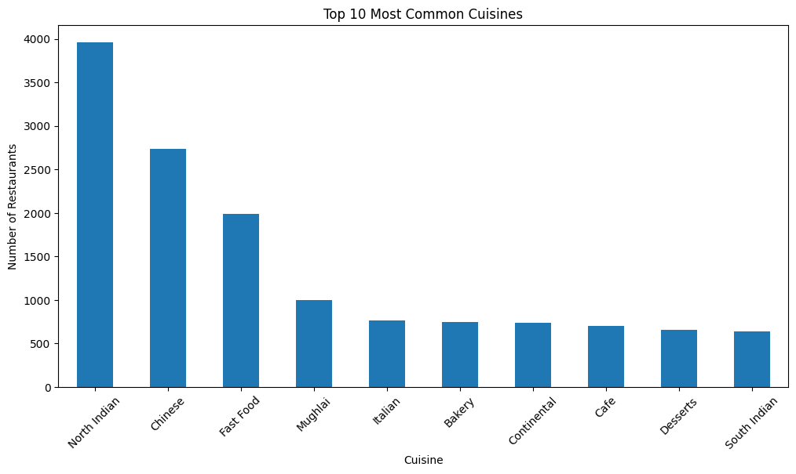

---

## 👍 Votes vs Aggregate Rating

Relationship between customer votes and restaurant ratings.

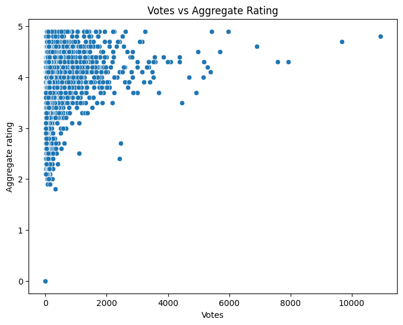

---

## 💰 Price Range vs Rating

Impact of restaurant price range on customer ratings.

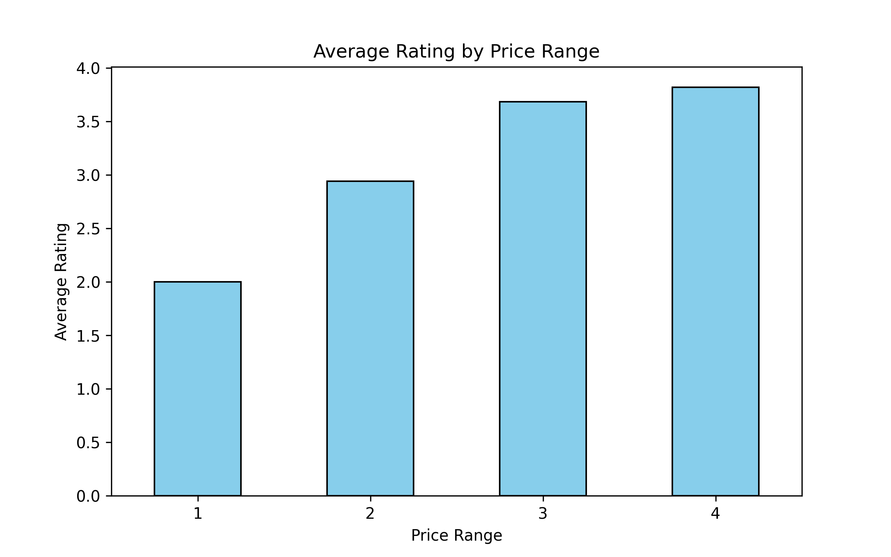

---

## 🔥 Correlation Heatmap

Correlation between numerical features.

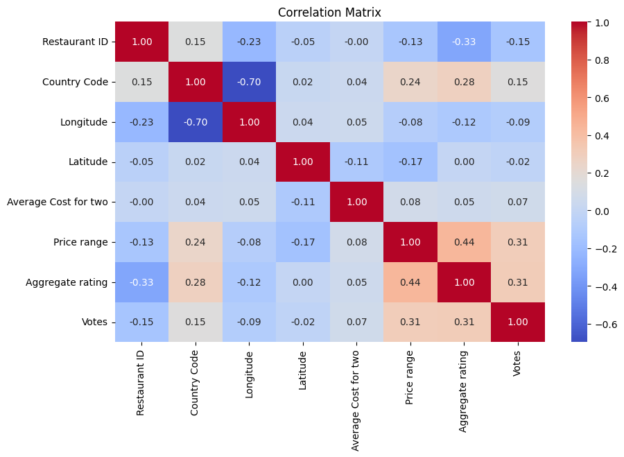

---

# ⚙️ Project Workflow

The complete workflow followed in this project is shown below.


### Workflow Steps

1. Dataset Loading
2. Data Cleaning
3. Exploratory Data Analysis
4. Feature Engineering
5. Feature Encoding
6. Train-Test Split
7. Model Training
8. Model Evaluation
9. Feature Importance Analysis
10. Model Saving

---

# 🤖 Machine Learning Models

The following regression algorithms were implemented:

- Linear Regression
- Decision Tree Regressor
- Random Forest Regressor

---

# 📈 Model Performance

The performance of all models was compared using **R² Score** and **RMSE**.

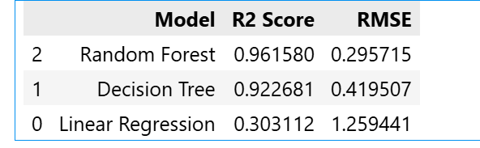

| Model | R² Score | RMSE |
|--------|---------:|-----:|
| Linear Regression | 0.303 | 1.259 |
| Decision Tree Regressor | 0.923 | 0.420 |
| **Random Forest Regressor** | **0.962** | **0.296** |

## 🏆 Best Model

The **Random Forest Regressor** achieved the highest prediction accuracy and the lowest prediction error.

---

# 📈 Feature Importance

Feature importance analysis was performed using the Random Forest model.

The following features contributed the most towards predicting restaurant ratings.

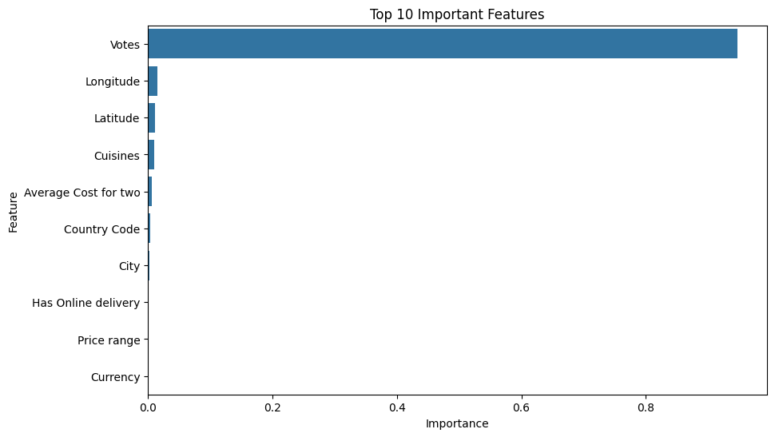

### Top Features

| Feature | Importance |
|----------|-----------:|
| Votes | 0.947476 |
| Longitude | 0.015274 |
| Latitude | 0.011814 |
| Cuisines | 0.010410 |
| Average Cost for Two | 0.006682 |

---

# 🛠 Technologies Used

- Python
- Pandas
- NumPy
- Matplotlib
- Seaborn
- Scikit-learn
- Joblib
- Streamlit

---

# 📁 Project Structure

```text
Task1_Restaurant_Rating_Prediction/
│
├── assets/
│   └── images/
│       ├── banner.png
│       ├── dataset.png
│       ├── missing_values.png
│       ├── rating_distribution.png
│       ├── top_cities.png
│       ├── top_cuisines.png
│       ├── votes_vs_rating.png
│       ├── price_vs_rating.png
│       ├── correlation_heatmap.png
│       ├── workflow.png
│       ├── model_comparison.png
│       └── feature_importance.png
│
├── data/
├── models/
├── notebooks/
├── reports/
├── src/
├── app.py
├── README.md
├── requirements.txt
└── .gitignore
```

---

# 🚀 How to Run

### Clone the Repository

```bash
git clone <repository-link>
```

### Install Dependencies

```bash
pip install -r requirements.txt
```

### Run the Application

```bash
streamlit run app.py
```

---

# 🚀 Future Improvements

- Hyperparameter tuning
- One-Hot Encoding
- Cross Validation
- XGBoost & LightGBM
- Interactive Dashboard
- Cloud Deployment

---

# 📚 References

- Scikit-learn Documentation
- Pandas Documentation
- NumPy Documentation
- Matplotlib Documentation
- Seaborn Documentation

---

# 👩‍💻 Author

**Dixa**


---

⭐ If you found this project helpful, consider giving it a **Star** on GitHub!
