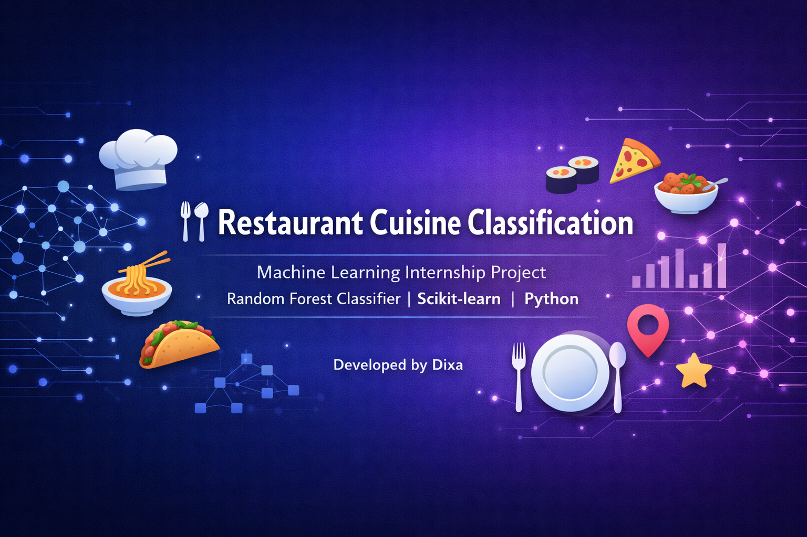
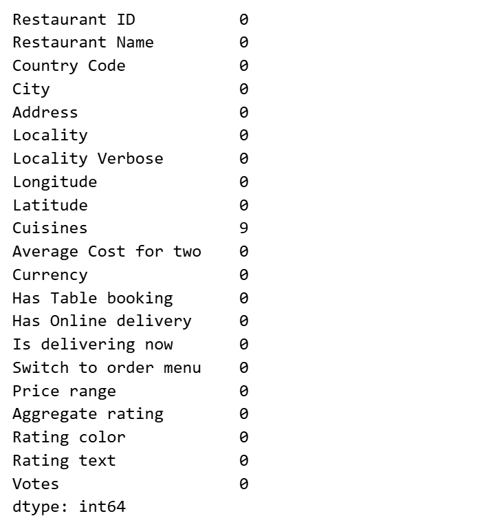
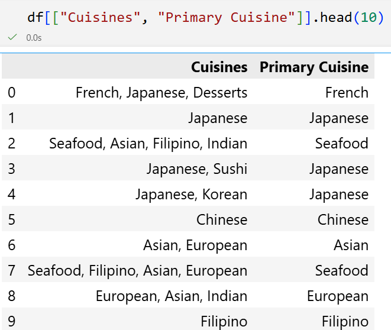
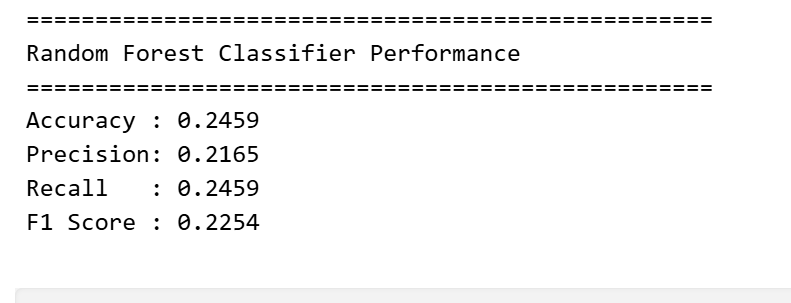
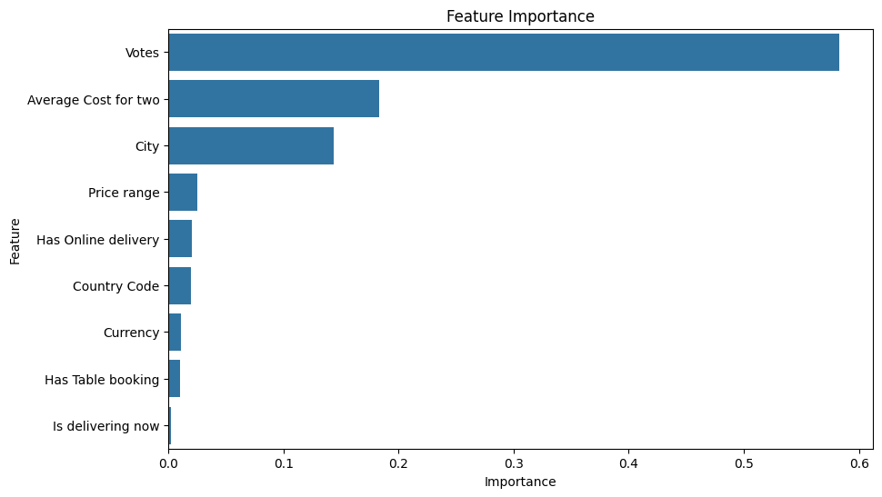
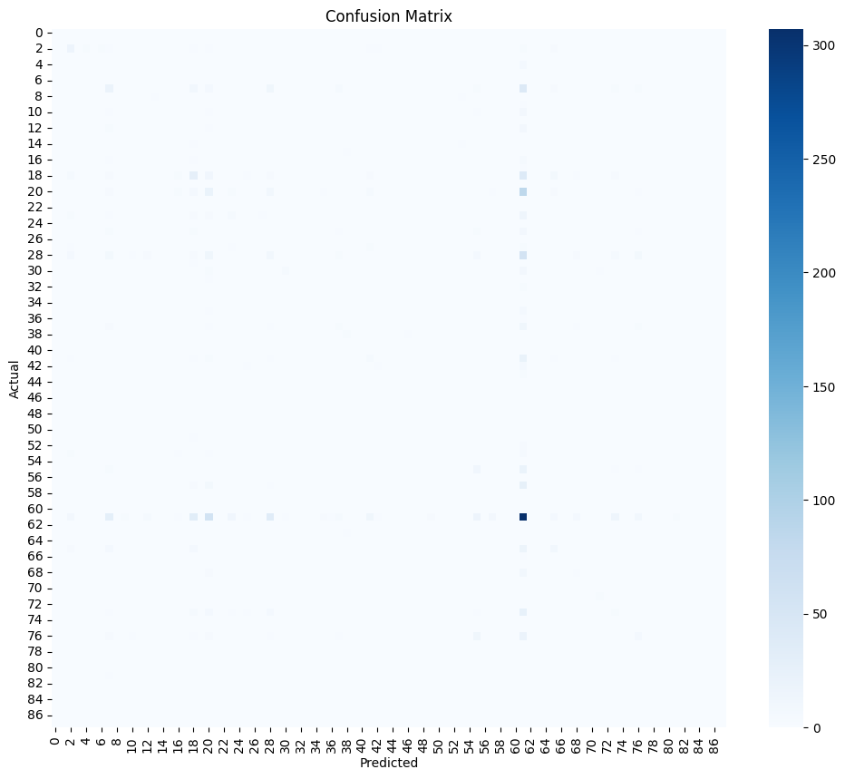

# 🍽 Restaurant Cuisine Classification

---

# 📌 Overview

(Write project overview)

---

# 🎯 Objective

(Write objective)

---

# 📂 Dataset

---

# 🧹 Data Cleaning

---

# 🔄 Primary Cuisine Selection

---

# ⚙ Methodology

┌─────────────────────────────┐
│         Dataset             │
└─────────────────────────────┘
              │
              ▼
┌─────────────────────────────┐
│      Data Cleaning          │
└─────────────────────────────┘
              │
              ▼
┌─────────────────────────────┐
│      Primary Cuisine        │
└─────────────────────────────┘
              │
              ▼
┌─────────────────────────────┐
│      Label Encoding         │
└─────────────────────────────┘
              │
              ▼
┌─────────────────────────────┐
│      Train-Test Split       │
└─────────────────────────────┘
              │
              ▼
┌─────────────────────────────┐
│ Random Forest Classifier    │
└─────────────────────────────┘
              │
              ▼
┌─────────────────────────────┐
│        Prediction           │
└─────────────────────────────┘
              │
              ▼
┌─────────────────────────────┐
│        Evaluation           │
└─────────────────────────────┘

---

# 🤖 Machine Learning Model

Random Forest Classifier

---

# 📊 Model Performance

---

# 📈 Feature Importance

---

# 📉 Confusion Matrix

---

# 🚀 Future Scope

...

---

# 👩‍💻 Author

Dixa
